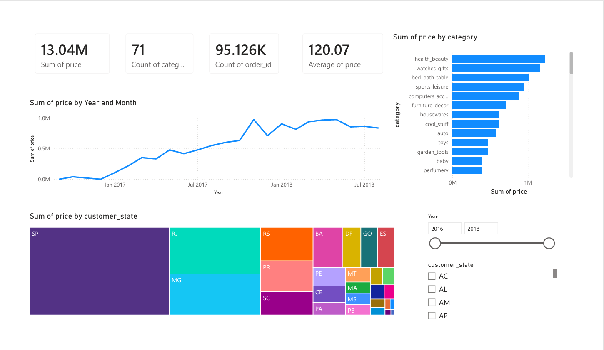

# Olist E-commerce Sales & Customer Analytics

SQL and Power BI analysis of 99,441 orders from the Olist Brazilian e-commerce dataset, covering revenue trends, top categories, delivery performance, and customer behavior.

## Problem
Analyze a real-world e-commerce dataset to find key revenue drivers, delivery performance issues, and customer retention opportunities for a multi-category online marketplace.

## Dataset
[Olist Brazilian E-Commerce Public Dataset](https://www.kaggle.com/datasets/olistbr/brazilian-ecommerce) — 9 relational tables covering orders, order items, payments, reviews, products, customers, and sellers (99,441 orders, Sep 2016 – Aug 2018).

## Tools
- **MySQL** — data cleaning, joins, window functions (RANK, LAG), CTEs
- **Power BI** — interactive dashboard with KPIs, trend analysis, and geographic breakdown
- **Python (Pandas)** — used to fix a malformed CSV import during data cleaning

## Steps
1. Imported 8 CSV files into MySQL and fixed data quality issues (encoding, malformed CSV rows, missing indexes)
2. Converted text-based date columns into proper DATETIME fields
3. Wrote 13+ SQL queries covering revenue, categories, states, payments, sellers, delivery time, review scores, month-over-month growth, and repeat customer rate
4. Built a Power BI dashboard connecting directly to MySQL via native queries
5. Designed KPI cards, a monthly revenue trend line, a top-10 category bar chart, and a state-level treemap with year/state slicers

## Key Insights
- **96,478** delivered orders analyzed, totaling **₹13.2M** in revenue (avg order value: ₹137.04)
- **health_beauty** is the top revenue category (₹1.23M), followed by watches_gifts and bed_bath_table
- **São Paulo (SP)** alone drives about **38%** of total revenue — nearly 3x the next-highest state
- **82%** of payment value comes from credit cards
- Average delivery time is **12.5 days**, with **8.11%** of orders delivered late
- Only **3%** of customers are repeat buyers — a clear retention opportunity
- Revenue grew steadily through 2017, peaking around November 2017, and stabilized through 2018

## Dashboard

## Files
- `SQL/analysis_queries.sql` — all cleaning and analysis queries
- `DASHBOARD/olist-ecommerce-dashboard.pbix` — Power BI dashboard file
- `DASHBOARD/dashboard-screenshot.png` — dashboard preview
